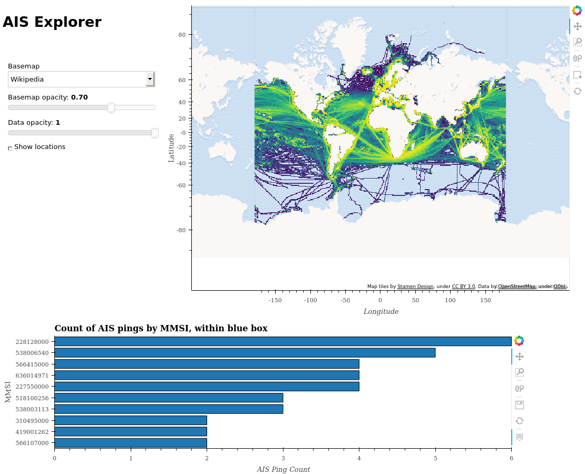

# geopython2019

Code based on the talk "PyViz for Mapping Global Shipping" @ GeoPython 2019. It is based heavily on various [PyViz](https://pyviz.org/) examples, so be sure to also check out them for more information.



# Installation
Assuming [Miniconda](https://docs.conda.io/en/latest/miniconda.html) (or [Anaconda](https://www.anaconda.com/distribution/#download-section)) is installed, within the root of the repo folder, run:

```
$ conda env update
```

This should create a *geopython* conda environment which you can activate with `conda activate geopython`.

# Run the App
## Data
To run the app, you'll need to create a [Datashader `SpatialPointsFrame`](http://datashader.org/user_guide/2_Points.html) with at least columns:
- positional information (numeric):`x` and `y`. 
- [`mmsi`](https://en.wikipedia.org/wiki/Maritime_Mobile_Service_Identity) (integer).

To run the app without having to change any code, this data should reside in the location *data/ais_spatial.parquet*.

You can often get some free/open AIS data online (not neccessarily global).

## Start the app
Having activated your conda environment with `conda activate geopython`, you can either start a `jupyter notebook` and run all the cells within [app.ipynb](https://github.com/UKHO/geopython2019/app.ipynb).

Alternatively, [Panel](http://panel.pyviz.org/) allows you to serve an app via (normally http://localhost:5006/app):

```
panel serve app.ipynb
```
